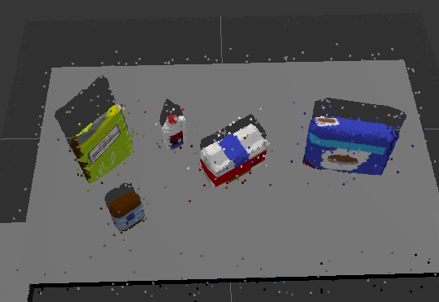
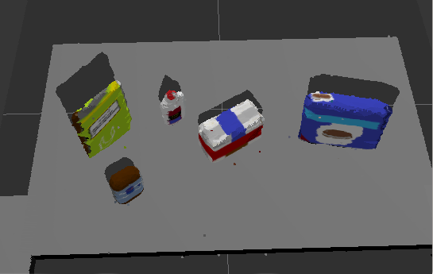
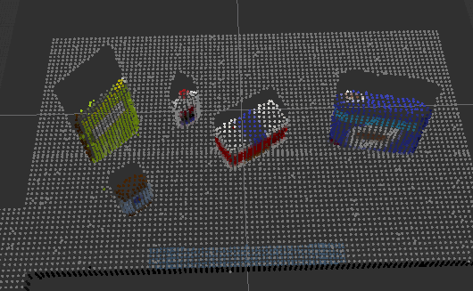
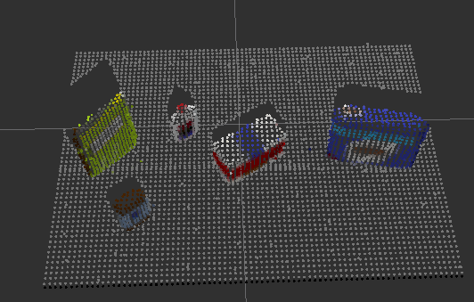
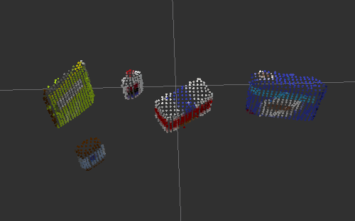
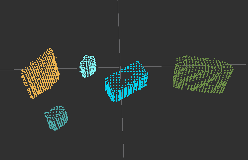

## Project: Perception Pick & Place
### Writeup Template: You can use this file as a template for your writeup if you want to submit it as a markdown file, but feel free to use some other method and submit a pdf if you prefer.

---


# Required Steps for a Passing Submission:
1. Extract features and train an SVM model on new objects (see `pick_list_*.yaml` in `/pr2_robot/config/` for the list of models you'll be trying to identify).
2. Write a ROS node and subscribe to `/pr2/world/points` topic. This topic contains noisy point cloud data that you must work with.
3. Use filtering and RANSAC plane fitting to isolate the objects of interest from the rest of the scene.
4. Apply Euclidean clustering to create separate clusters for individual items.
5. Perform object recognition on these objects and assign them labels (markers in RViz).
6. Calculate the centroid (average in x, y and z) of the set of points belonging to that each object.
7. Create ROS messages containing the details of each object (name, pick_pose, etc.) and write these messages out to `.yaml` files, one for each of the 3 scenarios (`test1-3.world` in `/pr2_robot/worlds/`).  [See the example `output.yaml` for details on what the output should look like.](https://github.com/udacity/RoboND-Perception-Project/blob/master/pr2_robot/config/output.yaml)  
8. Submit a link to your GitHub repo for the project or the Python code for your perception pipeline and your output `.yaml` files (3 `.yaml` files, one for each test world).  You must have correctly identified 100% of objects from `pick_list_1.yaml` for `test1.world`, 80% of items from `pick_list_2.yaml` for `test2.world` and 75% of items from `pick_list_3.yaml` in `test3.world`.
9. Congratulations!  Your Done!

# Extra Challenges: Complete the Pick & Place
7. To create a collision map, publish a point cloud to the `/pr2/3d_map/points` topic and make sure you change the `point_cloud_topic` to `/pr2/3d_map/points` in `sensors.yaml` in the `/pr2_robot/config/` directory. This topic is read by Moveit!, which uses this point cloud input to generate a collision map, allowing the robot to plan its trajectory.  Keep in mind that later when you go to pick up an object, you must first remove it from this point cloud so it is removed from the collision map!
8. Rotate the robot to generate collision map of table sides. This can be accomplished by publishing joint angle value(in radians) to `/pr2/world_joint_controller/command`
9. Rotate the robot back to its original state.
10. Create a ROS Client for the “pick_place_routine” rosservice.  In the required steps above, you already created the messages you need to use this service. Checkout the [PickPlace.srv](https://github.com/udacity/RoboND-Perception-Project/tree/master/pr2_robot/srv) file to find out what arguments you must pass to this service.
11. If everything was done correctly, when you pass the appropriate messages to the `pick_place_routine` service, the selected arm will perform pick and place operation and display trajectory in the RViz window
12. Place all the objects from your pick list in their respective dropoff box and you have completed the challenge!
13. Looking for a bigger challenge?  Load up the `challenge.world` scenario and see if you can get your perception pipeline working there!

## [Rubric](https://review.udacity.com/#!/rubrics/1067/view) Points
### Here I will consider the rubric points individually and describe how I addressed each point in my implementation.  

---
### Writeup / README

#### 1. Provide a Writeup / README that includes all the rubric points and how you addressed each one.  You can submit your writeup as markdown or pdf.  

You're reading it!

### Exercise 1, 2 and 3 pipeline implemented
#### 1. Complete Exercise 1 steps. Pipeline for filtering and RANSAC plane fitting implemented.

Convert the ROS message to point cloud
```python
cloud = ros_to_pcl(pcl_msg)
```


Remove the outlier points
```python
outlier_filter = cloud.make_statistical_outlier_filter()
outlier_filter.set_mean_k(10)
outlier_filter.set_std_dev_mul_thresh(0.1)
cloud = outlier_filter.filter()
```



Apply Voxel Grid Downsampling
```python
vox = cloud.make_voxel_grid_filter()
LEAF_SIZE = 0.01
vox.set_leaf_size(LEAF_SIZE, LEAF_SIZE, LEAF_SIZE)
cloud = vox.filter()
```


Remove the "not table" points with PassThrough filter
```python
passthrough_y = cloud.make_passthrough_filter()
passthrough_y.set_filter_field_name('y')
passthrough_y.set_filter_limits(-0.4, 0.4)
cloud = passthrough_y.filter()

passthrough_z = cloud.make_passthrough_filter()
passthrough_z.set_filter_field_name('z')
passthrough_z.set_filter_limits(0.6, 0.9)
cloud = passthrough_z.filter()
```


Remove the table with RANSAC plane segmentation
```python
seg = cloud.make_segmenter()
seg.set_model_type(pcl.SACMODEL_PLANE)
seg.set_method_type(pcl.SAC_RANSAC)
seg.set_distance_threshold(0.01)
inliers, coefficients = seg.segment()
cloud = cloud.extract(inliers, negative=True)
```



#### 2. Complete Exercise 2 steps: Pipeline including clustering for segmentation implemented.  

Generate cluster indices with eucledian clustering
```python
white_cloud = XYZRGB_to_XYZ(cloud)
tree = white_cloud.make_kdtree()
ec = white_cloud.make_EuclideanClusterExtraction()
ec.set_ClusterTolerance(0.01)
ec.set_MinClusterSize(100)
ec.set_MaxClusterSize(250000)
ec.set_SearchMethod(tree)
cluster_indices = ec.Extract()
```

Create Cluster-Mask Point Cloud to visualize each cluster separately
```python
cluster_color = get_color_list(len(cluster_indices))
color_cluster_point_list = []
for j, indices in enumerate(cluster_indices):
    for i, indice in enumerate(indices):
        color_cluster_point_list.append([white_cloud[indice][0],
                                        white_cloud[indice][1],
                                        white_cloud[indice][2],
                                        rgb_to_float(cluster_color[j])])
# create and publish point cloud for debugging clusters
cluster_cloud = pcl.PointCloud_PointXYZRGB()
cluster_cloud.from_list(color_cluster_point_list)
pcl_msg = pcl_to_ros(cluster_cloud)
pcl_objects_pub.publish(pcl_msg)
```



#### 2. Complete Exercise 3 Steps.  Features extracted and SVM trained.  Object recognition implemented.

For training data generation:
  - I only used a 24bins histogram of the hue values. Using only the hue values made sense because the objects have pretty distinct color schemes.
  - Since the objects are standing on the table i minimalized the random roll and pitch values during the feature capturing process.
  - I applied the same voxel grid sampling to the training data
  - To reduce overfittig a bit, i randomly removed 20% of the captured points

Iterate over the point cluster and predict the labels for every object
```python
# Publish the list of detected objects
detected_objects_labels = []
detected_objects = []

for index, pts_list in enumerate(cluster_indices):
    # Grab the points for the cluster from the extracted outliers (cloud_objects)
    # print('cloud l', len(pts_list))
    pcl_cluster = cloud.extract(pts_list)
    pcl_object_pubs[index].publish(pcl_to_ros(pcl_cluster))
    # TODO: convert the cluster from pcl to ROS using helper function
    pcl_msg = pcl_to_ros(pcl_cluster)
    # Extract histogram features
    # TODO: complete this step just as is covered in capture_features.py
    chists = compute_color_histograms(pcl_msg, using_hsv=True)
    normals = get_normals(pcl_msg)
    nhists = compute_normal_histograms(normals)
    feature = np.concatenate((chists, nhists))

    # Make the prediction, retrieve the label for the result
    # and add it to detected_objects_labels list
    # print('feature.reshape(1,-1)', feature.reshape(1,-1))
    prediction = clf.predict(scaler.transform(feature.reshape(1,-1)))
    label = encoder.inverse_transform(prediction)[0]
    detected_objects_labels.append(label)

    # Publish a label into RViz
    label_pos = list(white_cloud[pts_list[0]])
    label_pos[2] += .4
    object_markers_pub.publish(make_label(label,label_pos, index))

    # Add the detected object to the list of detected objects.
    do = DetectedObject()
    do.label = label
    do.cloud = pcl_msg
    detected_objects.append(do)

rospy.loginfo('Detected {} objects: {}'.format(len(detected_objects_labels), detected_objects_labels))
```

### Pick and Place Setup

#### 1. For all three tabletop setups (`test*.world`), perform object recognition, then read in respective pick list (`pick_list_*.yaml`). Next construct the messages that would comprise a valid `PickPlace` request output them to `.yaml` format.

Generate PickPlace requests and save them into .yaml
```python
# Publish the list of detected objects
# This is the output you'll need to complete the upcoming project!
detected_objects_pub.publish(detected_objects)

object_list_param = rospy.get_param('/object_list')
dropbox_param = rospy.get_param('/dropbox')
dropbox = dict(zip([box['group'] for box in dropbox_param], dropbox_param))

labels = []
centroids = []
yaml_list = []

for do in detected_objects:
    labels.append(do.label)
    points_arr = ros_to_pcl(do.cloud).to_array()
    centroids.append(np.mean(points_arr, axis=0)[:3].tolist())

for i, param in enumerate(object_list_param):
    test_scene_num = Int32()
    test_scene_num.data = SCENE_NUM
    object_name = String()
    object_name.data = param['name']
    arm_name = String()
    arm_name.data = param['group']
    pick_pose = Pose()
    place_pose = Pose()

    if param['name'] in detected_objects_labels:
        detected_index = detected_objects_labels.index(param['name'])
        print('detected', i, detected_index, param['name'])
        centroid = centroids[detected_index]
        pick_pose.position.x = centroid[0]
        pick_pose.position.y = centroid[1]
        pick_pose.position.z = centroid[2]
        place_pose.position.x = dropbox[param['group']]['position'][0]
        place_pose.position.y = dropbox[param['group']]['position'][1]
        place_pose.position.z = dropbox[param['group']]['position'][2]

        yaml = make_yaml_dict(test_scene_num=test_scene_num,
                              object_name=object_name,
                              arm_name=arm_name,
                              pick_pose=pick_pose,
                              place_pose=place_pose)
        yaml_list.append(yaml)
    else:
        print('Cant find "{}"'.format(param["name"]))
send_to_yaml('output_{}.yaml'.format(SCENE_NUM), yaml_list)
```

 - [output_1.yaml](pr2_robot/scripts/output_1.yaml)
 - [output_2.yaml](pr2_robot/scripts/output_2.yaml)
 - [output_3.yaml](pr2_robot/scripts/output_3.yaml)

Spend some time at the end to discuss your code, what techniques you used, what worked and why, where the implementation might fail and how you might improve it if you were going to pursue this project further.  

 - It took me much more time to find the best settings for the training data generation and the SVM model, but when i limited my feature set to the Hue values it started to work much better.
 - Using probability predictions could help to classify the missed objects.
 - Removing parts of the objects in the training data could help detecting object partially covered by other objects.
